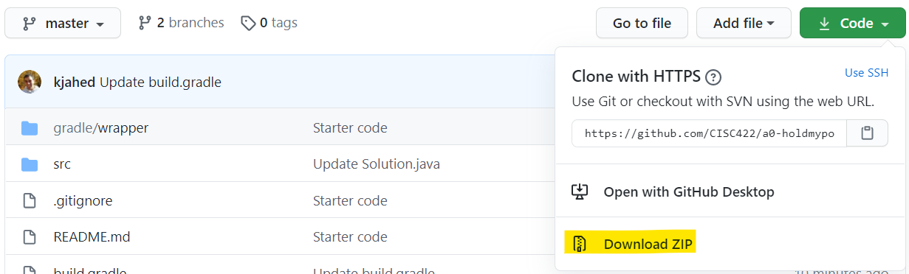
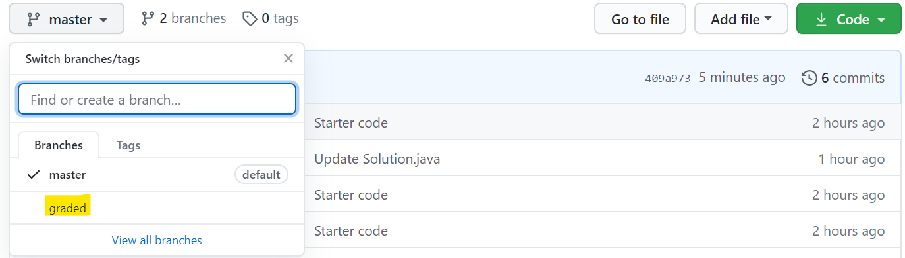

# CISC/CMPE 422: Formal Methods in Software Engineering (Fall 2022)
## Assignment 1: Evaluating predicate logic queries for time series data
## Due date: Thurs, Sept 29, 5pm (GitHub classroom and OnQ submission)


## Learning Outcomes
The purpose of this assignment is to give you practical experience with
-  expressing properties formally and declaratively using queries and constraints in first-order logic, 
-  defining the syntax of a language through the use of a parser, 
-  defining the semantics of a language through the implementation of an evaluator, and
-  incremental software development,

as well as exposure to relevant software engineering tooling such as 
-  code repositories such as GitHub,
-  parser generators such as ANTLR, and
-  build systems such as Gradle.
        
## Intro
In this assignment, you will implement an evaluator for a language called QL (Query Language). Starter code is provided that already contains code to read in all necessary input. In particular, a parser and an abstract syntax tree builder for QL are given, which will construct an appropriate internal representation for your evaluation code to operate on. 

QL is based on predicate logic and has been designed specifically to express properties of and queries for 2-dimensional arrays of sales data. Every row in such an array represents a different product, while every column represents a different day. Individual products (or days) in the array will be referred by the (1-based) number of the row (or column) they are in. Consider, for instance, the array:
<pre>  3  2  5 10  0
  0  1  4  0  9
  1  9  2  3  2
  2  0  1  2  2
</pre>

This array contains sales amounts for 4 products (which can be referred by the natural numbers 1 to 4) on 5 days (which can be referred to by the natural numbers 1 to 5). It expresses that, e.g., 3 units of product 1 were sold on day 1, 4 units of product 2 were sold on on day 3, and 10 units of product 1 were sold on day 4. 

## Description of QL
QL allows the formulation of formulas and expressions that are evaluated using such a sales array. Formulas can capture properties such as <i>"no product had a day with no sales"</i>, while expressions can be used to express queries to, e.g., collect <i>"the set of days with at least one product with no sales"</i>, or determine <i>"the number of products with sales greater than 10 on day 1"</i>. The syntax of QL is defined by the following grammar. 

```g4   
   // formulas
   <Formula>       ::= <AtomicN> | <AtomicS> | <Unary> | <Binary> | <Quantified> 
   <AtomicN>       ::= <NExp> <RelNOp> <NExp>
   <AtomicS>       ::= <SExp> <RelSOp> <SExp>
   <Unary>         ::= <UnConn> <Formula> | <Bracketed>
   <Binary>        ::= <Formula> <BinConn> <Formula>
   <Quantified>    ::= <Quantifier> <Var> ':' <Type> '.' <Formula>
   <Bracketed>     ::= '('<Formula>')'
   <UnConn>        ::= '!' | 'not'
   <BinConn>       ::= '&&' | 'and' | '||' | 'or' | '=>' | 'implies' | '<=>' | 'iff'
   <Quantifier>    ::= 'forall' | 'exists'
   <Var>           ::= Identifier
   <RelNOp>        ::= '=' | '<' | '<=' | '>' | '>='
   <RelSOp>        ::= '=' 
   
   // numeric expressions
   <NExp>          ::= <Nat> | <Var> | <SalesForM> | <SalesForD> | <SalesForP> | <SalesAt> | 
                       <Size> | <NExp><BinNOp><NExp> | <BracketedNExp>
   <Nat>           ::= natural number
   <SalesForM>     ::= 'salesForM(M)'
   <SalesForD>     ::= 'salesForD(M,'<NExp>')'
   <SalesForP>     ::= 'salesForP(M,'<NExp>')'
   <Size>          ::= 'size' '('<sExp>')'
   <SalesAt>       ::= 'M['<NExp>','<NExp>']'
   <BinNOp>        ::= '+' | '-' | '*' | '/'
   <BracketedNExp> ::= '('<NExp>')'
   
   // set expressions
   <SExp>          ::= <Type> | <SetCompr> | <BinarySExp> | <BracketedSExp>
   <SetCompr>      ::= '{'<Var> ':' <Type> '|' <Formula>'}'
   <BinarySExp>    ::= <SExp> <BinSOp> <SExp> 
   <BracketedSExp> ::= '('<SExp>')'
   <Type>          ::= 'Day' | 'Prod' | 'Sale' 
   <BinSOp>        ::= '+' | '&' | '-'
```

Start symbols are <tt>&lt;Formula&gt;</tt>, <tt>&lt;NExp&gt;</tt>, and <tt>&lt;SExp&gt;</tt>.
Formulas (non-terminal <tt>&lt;Formula&gt;</tt>) can contain quantification (over days, products, and sales amounts), the standard propositional connectives (negation, conjunction, disjunction, implication, and logical equivalence), as well as numerical expressions and set expressions. Numerical expressions (<tt>&lt;NExp&gt;</tt>) evaluate to a number (representing, e.g., a day, a product, a sales amount, the size of a set, or the result of some arithmetic operation on these). Set expressions (<tt>&lt;SExp&gt;</tt>) evaluate to sets of numbers.
To access the sales array, the following numeric expressions can be used:
-  <tt>M[&lt;NExp&gt;,&lt;NExp&gt;]</tt> which refers to a cell in the array with the arguments denoting, in this order, the product (i.e., row) and the day (i.e., column), respectively. E.g., for the sales array above, the expression <tt>M[2,3]</tt> would evaluate to 4.
-  <tt>salesForD(M,&lt;NExp&gt;)</tt> which refers to the sum of all sales on the day denoted by the argument. E.g., for the sales array above, <tt>salesForD(M,3)</tt> would evaluate to 12.
-  <tt>salesForP(M,&lt;NExp&gt;)</tt> which refers to the sum of all sales of the product denoted by the argument. E.g., for the sales array above, <tt>salesForP(M,3)</tt> would evaluate to 17.
-  <tt>salesForM(M)</tt> which refers to the sum of all sales for all products on all days. E.g., for the sales array above, <tt>salesForM(M)</tt> would evaluate to 58.
        
Moreover, numerical expressions can be built by computing the size of a set, or performing some standard artithmetic operation such as addition or multiplication, etc.

To build set expressions, the following atomic set expressions are supported:
-  <tt>Day</tt>, which refers to the set of days used in the sales array. E.g., for the array above, <tt>Day</tt> would evaluate to the set <tt>{1,2,3,4,5}</tt>.
-  <tt>Prod</tt>, which refers to the set of products used in the sales array. E.g., for the array above, <tt>Prod</tt> would evaluate to the set <tt>{1,2,3,4}</tt>.
-  <tt>Sale</tt>, which refers to the set of sale amounts used in the sales array. E.g., for the array above, <tt>Sale</tt> would evaluate to the set <tt>{0,1,2,3,4,5,9,10}</tt>.
    
Also, set comprehension is available. E.g., for the array above, <tt>{s:Sale | exists p:Prod. exists d:Day. M[p,d]=s && s&gt;=5}</tt> would evaluate to the set <tt>{5,9,10}</tt>. Finally, the standard set operations union (denoted by <tt>+</tt>), intersection (<tt>&</tt>), and difference (<tt>-</tt>) can also be used to build sets.

### Examples
- Using QL, the property <i>"no product had a day with no sales"</i> can be expressed by the formula <tt>!(exists p:Prod. exists d:Day. M[p,d]=0)</tt> or by the formula <tt>forall p:Prod. forall d:Day. !(M[p,d]=0)</tt>. 
- To determine <i>"the set of days with at least one product with no sales"</i> the set comprehension <tt>{d:Day | exists p:Prod. M[p,d]=0}</tt> can be used.
- The numerical expression <tt>size({p:Prod | M[p,1]&gt;10})</tt> will evaluate to the <i>"the number of products with sales greater than 10 on day 1"</i>.

## Parsing QL
Before a QL formula or expression can be evaluated, it must be parsed. The evaluator code provided to you already contains a parser. That parser has been generated with the ANTLR parser generator ([www.antlr.org](https://www.antlr.org)). After the QL formula or expression has been read in, the parser will, assuming that it is syntactically correct, build and return an internal representation of it in the form of an [abstract syntax tree (AST)](https://en.wikipedia.org/wiki/Abstract_syntax_tree). The following class diagram describes the classes and their relationships (attributes) used to define ASTs (note the correspondence between this class diagram and the grammar). 


In the diagram above, the top-level classes <tt>Formula</tt>, <tt>NExp</tt>, and <tt>SExp</tt> are high-lighted for readability; their names are shown in italics, because they are abstract; classes labeled with 'E' in the upper right-hand corner are enumerations; also, all associations have an implicit 'exactly 1' multiplicity constraint on their target end (e.g., objects of type <tt>AtomicS</tt> have two attributes <tt>lhs</tt> and <tt>rhs</tt> each of which will point to exactly one object of type <tt>SExp</tt>). Note that the grammar contains productions allowing for bracketed formulas and expressions, but, for simplicity, the class diagram does not contain classes for these. Instead, AST builder produces an instance of the type of the bracketed formula or expression (e.g., the type of the root object of the AST for <tt>(2+3)</tt> will be <tt>BinNExp</tt>, rather than <tt>BracketedNExp</tt>).

The following object diagram shows the AST created for the formula <tt>forall d:Day. exists p:Prod. !(M[p,d]>5)</tt>. Note how the AST conforms to class diagram, i.e., the AST objects have the attributes shown in the class diagram.


Note that the starter code contains code that will create these object diagrams for the input formula or expression. 

## Provided evaluator code

The structure of the starter code is as follows: The QL grammar for ANTLR is stored in file [<tt>src/main/antlr/QL.g</tt>](src/main/antlr/QL.g), and after the build, the generated parser will reside in directory <tt>src/generated/java/ql</tt>. Directory [<tt>src/main/java</tt>](src/main/java/) contains code to
- build the AST after the parsing (subdirectory [<tt>ast</tt>](src/main/java/ast/)), 
- read in a sales array from a file in csv format (class [<tt>CSVReader</tt>](src/main/java/CSVReader.java)), 
- implement an <i>environment</i>, i.e., a data structure that stores the binding of variables to values (class [<tt>Env</tt>](src/main/java/Env.java)), 
- declare methods to evaluate formulas and expressions (class [<tt>BaseEval</tt>](src/main/java/BaseEval.java)), and
- declare exceptions for problems that might occur during the evaluation (class [<tt>BaseEval</tt>](src/main/java/BaseEval.java)).

It also contains the class [<tt>Main</tt>](src/main/java/Main.java) which
- reads in the command line arguments,
- calls the csv reader, the parser, and the AST builder (and, optionally, draws the AST of the input formula or expression),
-  creates an instance of the [<tt>Eval</tt>](src/main/java/Eval.java) class which has access to the sales array read in and starts the evaluation by invoking the top-level [<tt>eval</tt>](src/main/java/BaseEval.java#L56-L66) method with the AST of the input formula or expression as argument (line [<tt>boolean result = new Eval(data).eval(ast)</tt>](src/main/java/Main.java#L112)), and then
-  outputs the evaluation result, or an error message should an exception be thrown during the evaluation. 


### Running the provided evaluator code
Use your favourite means to clone and create a local copy of this repository. If you are unfamiliar with GitHub and don't know how to do this, please see the [GitHub Classroom Quick Start pages](https://github.com/CISC422/classroom-quickstart). 
Using Git-Bash, the following will clone, build, and run all unit tests in [<tt>src/test/java</tt>](src/test/java) (note that all tests will fail on the starter code).

```$xslt
git clone https://github.com/CISC422/<your_repository> a1
cd a1 && ./gradlew test
```

To build a runnable jar file <tt>eval.jar</tt> with Git-Bash run the Gradle (a build tool) wrapper in directory <tt>a1</tt>
```$xslt
./gradlew jar
```

The evaluator supports the following command line options:
```$xslt
Usage: java -jar eval.jar (-f=<fOrExpr> | -i) [-hVx] <mFile>
      <mFile>     Input data file
  -f=<fOrExpr>    Formula or expression to evaluate
  -h, --help      Show this help message and exit
  -i              Parse input from stdin
  -V, --version   Print version information and exit
  -x              Show AST
```

#### Examples
- <tt>java -jar eval.jar -f='forall p:Prod. forall d:Day. !(M[p,d]=0)' m1.csv</tt> will run the evaluator on the given formula and the sales array in file <tt>sa1.csv</tt>. 

- <tt>java -jar eval.jar -i sa1.csv</tt> starts an interactive input session in which formulas or expressions can be input (one per line) and which will be evaluated on <tt>sa1.csv</tt> whenever each line is terminated. <tt>Ctlr-c</tt> or 'exit' ends the interactive input session. For instance, the screen shot below shows the use of the interactive input to evaluate the three QL examples given above in the sales array also given above:

- <tt>java -jar eval.jar -f='forall p:Prod. forall d:Day. !(M[p,d]=0)' -x sa1.csv</tt> will behave as the previous invocation, and also open a window showing the AST of the input formula.


Note that all three command line invocations above assume that a file 'sa1.csv' in comma-separated-values format exists in the root directory of your local repo. You can create these csv files from scratch, or copy and modify <tt>salesArray.csv</tt> in [<tt>src/test/resources</tt>](src/test/resources).

## Your task
Your task is to implement the evaluation function for QL formulas and expressions. To this end, complete the implementation of the class <tt>Eval</tt>(src/main/java/Eval.java) in [<tt>src/main/java</tt>](src/main/java). [<tt>Eval</tt>](src/main/java/Eval.java) imports the AST classes which will allow you to access the AST passed in from the call <tt>eval(ast)</tt> in lines 105, 112, and 119 in [<tt>Main</tt>](src/main/java/Main.java#L105-L117). Depending on the type of the top-level node of the AST, this call will in invoke [<tt>evalFormula(formula, new Env())</tt>, <tt>evalNExp(nExp, new Env())</tt>, or <tt>eval(sExp, new Env())</tt>](src/main/java/BaseEval.java#L47-L57). You must complete the class [<tt>Eval</tt>](src/main/java/Eval.java) by providing implementations of these three methods. Note that you should modify only the class <tt>Eval</tt> and no other class should be changed. 

In general, the evaluation will require a traversal of the AST. We suggest that you break down the implementation of <tt>evalFormula(Formula f, Env e)</tt>, <tt>evalNExp(NExp nExp, Env e)</tt>, and <tt>eval(SExp sExp, Env e)</tt> in <tt>Eval.java</tt> into the following incremental development steps, each of which you should test thoroughly before advancing to the next step. Note that the environment mentioned above will not be needed until Step 5. 
- <b>Step 1: No variables, atomic formulas and expressions only</b><br>
  First, assume that the input to be evaluated does not contain any variables and is atomic, as in, for instance, <tt>Day=Prod</tt>, <tt>1&gt;3</tt>, <tt>42</tt>, <tt>Sale</tt>, or <tt>salesForM(M)</tt>. In this case, your implementation of <tt>evalFormula</tt>, <tt>evalNExp</tt>, and <tt>evalSExp</tt> should be straight-forward with symbols denoting numbers (such as <tt>42</tt>) or relational operators comparing them (see non-terminal <tt>&lt;RelNOp&gt;</tt> in grammar) having their standard meaning. As mentioned above, the numeric expression <tt>salesForM(M)</tt> should evaluate to the sum of all sales amount of all products on all days, while the atomic set expressions <tt>Day</tt>, <tt>Prod</tt>, and <tt>Sale</tt> should evaluate to, respectively, the set of days, products, and sales amounts occuring in the input sales array. 
- <b>Step 2: No variables, atomic formulas and set expressions, but composite numeric expressions</b>  
    Add support for composite numeric expressions such as <tt>1+2</tt>, <tt>(2*(3+4))/3</tt>, <tt>1+M[5-3,2]</tt>, <tt>salesForD(M,2*3)</tt>, and <tt>salesForP(M,3)</tt>. The arithmetic operators (see <tt>&lt;BinNOp&gt;</tt> in grammar) should have their standard meaning with <tt>'/'</tt> representing truncating division on natural numbers (e.g., <tt>5/2</tt> should evaluate to 2). <tt>salesForD</tt> should evaluate to the sum of the sales amounts for all products on a given day. Similarly for <tt>salesForP</tt>. 
- <b>Step 3: No variables, atomic formulas, but composite numeric expressions and composite set expressions (w/o set comprehension)</b>  
    Add support for composite set expressions such as <tt>Day + Prod</tt>, and <tt>(Sale - Day) &amp; Prod</tt> where the set operators (see <tt>&lt;BinSOp&gt;</tt> in grammar) should have their standard meaning.
- <b>Step 4: No variables, but composite formulas and expressions (w/o set comprehension)</b>  
    Add support for composite formulas such as <tt>!(Day+Prod = Day)</tt>, and <tt>(M[1,2]=M[2,1] &amp;&amp; Day=Prod)</tt> where the propositional connectives (see <tt>&lt;UnConn&gt;</tt> and <tt>&lt;BinConn&gt;</tt>) should have their standard meaning. 
- <b>Step 5: Composite formulas and expressions with variables, but no set comprehension</b>  
    Add support for quantified formulas such as 
	<tt>forall p:Prod. exists d:Day. forall p1:Prod. (!p=p1 =&gt; M[p,d]&gt;=M[p1,d])</tt>. 
	The occurrence of an identifier <tt>x</tt> in some formula evaluates to a value in the type of the <i>most recent quantification of</i> <tt>x</tt> that contains that occurrence of <tt>x</tt> in its scope. That quantification also determines whether <tt>x</tt> is universally or existentially quantified. For instance, identifier <tt>x</tt> in the array access <tt>M[x,2]</tt> in the formula 
    <tt>forall x:Day. exists s:Sale. exists x:Prod. M[x,2]=s</tt>
    is existentially quantified and may evaluate to any product in the sales array. This scoping rule has the following consequences:
   1. The environment (i.e., the data stucture that holds the variable bindings) should behave like <i>stack</i>, i.e., a new binding for some variable <tt>x</tt> put into the environment for the purposes of evaluating some subformula <tt>f</tt> should not destroy any existing bindings of <tt>x</tt>, but only 'shadow' them temporarily until the evaluation of <tt>f</tt> is complete and then be removed. That is why <tt>Env</tt> is implemented as a stack. Also, note that the method <tt>lookup</tt> returns the value in the binding of <tt>x</tt> that is closest to the top of the stack (i.e., that was pushed onto the stack most recently). You should use the class <tt>Env</tt> as is (again, all your changes should be confined to class <tt>Eval</tt>). 
   2. If the scope of a quantification of <tt>x</tt> over a non-empty domain does not contain any free occurrences of <tt>x</tt>, that quantification is <i>redundant</i>. For instance, since the scope of the outermost quantification in the above formula does not contain a free occurrence of <tt>x</tt>, that quantification can be omitted, that is, the above formula is logically equivalent to 
        <tt>
        	  exists s:Sale. exists x:Prod. M[x,2]=s
              </tt>
		Thus, the formula 
        <tt>
        	    (forall x:Day. exists s:Sale. exists x:Prod. M[<u>x</u>,2]=s)  &lt;=&gt;   (exists s:Sale. exists x:Prod. M[<u>x</u>,2]=s)
        	</tt>
        should be valid, i.e., evaluate to <tt>true</tt> for any sales array.
- <b>Step 6: All of QL</b>  
      Add support for set comprehension.
  

### Error conditions
Not every syntactically correct QL formula or expression can be evaluated. I.e., there are syntactically correct formulas and expressions that do not have a value.
There are two cases in which this can occur:

1. Division by 0: As, for instance, in <tt>1 = 3/(1-1)</tt>.

2. Free variable: If the formula contains an occurrence of a variable <tt>x</tt> that is not bound by any quantification, that is, it is a <i>free</i> occurrence of <tt>x</tt>, then that occurrence of <tt>x</tt> cannot be evaluated. Consider, for instance,
   - <tt>5 = x</tt>
   - <tt>forall p:Prod. M[p,d]=2</tt>
   - <tt>(exists s:Sale. s&gt;100) &amp;&amp; s&lt;50</tt>

The provided code defines two exceptions (<tt>DivisonByZeroException</tt> and <tt>UnboundException</tt>) for each of these cases (class [<tt>BaseEval</tt>](src/main/java/BaseEval.java)). When your implementation of the evaluation detects that the input formula or expression cannot be evaluated, it should raise the corresponding exception (which will then be caught in [<tt>Main.java</tt>](src/main/java/Main.java#L125) and cause an appropriate error message to be printed). 

## Hints
- The parser doesn't handle operator precedences right, that is, <tt>3 + 4 * 6</tt> gets parsed into <tt>(3 + 4) * 6</tt>, not <tt>3 + (4 * 6)</tt>. Always use parenthesis to enforce the intented order of evaluation.
- To determine the type of a formula or expression, you may find Java's <tt>instanceof</tt> operator useful.
- Your implementation of the evaluation routine should be relatively short (our reference implementation of <tt>Eval.java</tt> consists of significantly less than 300 lines of code).    
## Notes
- The lexer (converts the input stream of characters into a stream of tokens) and the parser (converts the stream of tokens into an AST) used in the starter code have been generated using [ANTLR](https://www.antlr.org). The use of lexer and parser generators is very common in industry. ANTLR is one of the most mature and widely used such tools. Other frequently used generators include JavaCC, Java CUP, and LEX/YACC.
- The sales arrays used in this assignment are an example of [time series data](https://en.wikipedia.org/wiki/Time_series) as found in many business, industrial, social, scientific, and engineering domains. Note how QL and its tooling (including your evaluator) could easily be changed to support other kinds of time series such as rain measurements, stock prices, or body temperature readings.
- The Gradle wrapper file [<tt>gradlew.bat</tt>](gradlew.bat) in the starter code will build the code for you which includes resolving any dependencies by downloading the necessary code (such as ANTLR or any Java libraries) and invoking the parser generator. Industrial code is almost always built using build automation software such as Gradle. Other popular build tools include make, Apache Ant, and Apache Maven. 
    
## Instructions

**Important: ignoring the instructions below may reduce your grade!**
- You may only change the contents of <tt>Eval.java</tt> and <tt>TestEval.java</tt>. You may add other files if necessary. Leave all other files unchanged. Also, <tt>Eval.java</tt> should not print anything to the console. Make sure you comment out any print statements prior to submission. 
- Document the your code appropriately.
- Test your implementation using the code and sales array provided in <tt>src/test</tt>, but note that your code will also be tested using <i>other</i> formulas, expressions, and sales arrays.
    
    
## What and how to submit
Submit your assignment before the deadline to GitHub **and** OnQ. For the OnQ submission, download an archive of your repository **from GitHub** and upload it **as is** to OnQ. Only submissions present **on both** GitHub and OnQ will be graded.




### After the deadline 
You access to the repository will be revoked until after the assignment is graded. Once the grading is complete, a new branch ``graded`` will be pushed to your repository
containing your feedback in PDF format (``feedback.pdf``) format. The feedback file will also be published to OnQ.

You can switch to the ``graded`` branch on GitHub by selecting it from the branches drop down menu, e.g.,


